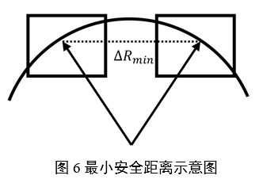
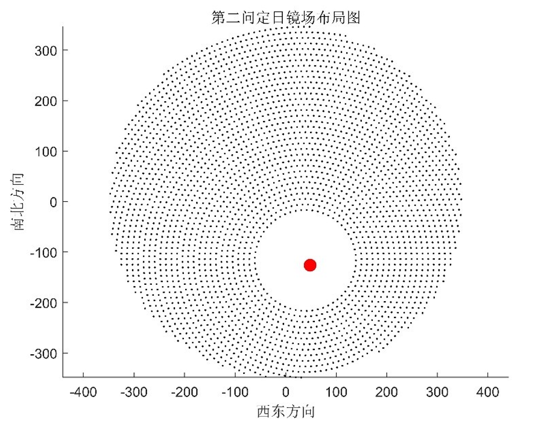

# 定日镜场优化设计模型——国家级一等奖方案
我们团队的这份方案获得了**全国大学生数学建模竞赛（CUMCM 2023）的国家级一等奖**！

CUMCM 2023 有来自全国及美国、澳大利亚、马来西亚的 1685 所院校的 59611 队，近 18 万人报名参赛。最终在本科组比赛中，共 299 队获全国一等奖，**获奖率为 0.5%**，我们有幸成为其中之一！

## 背景知识
构建以新能源为主体的新型电力系统，是我国实现“**碳达峰**”“**碳中和**”目标的一项重要
措施。**塔式太阳能光热发电**是一种低碳环保的**新型清洁能源技术** [1]。

  

在塔式太阳能光热发电站中，**定日镜场**扮演着至关重要的角色，它由众多**定日镜**组成。这些定日镜随着太阳的运动而自动调整位置，以精确地将太阳光线汇聚到**吸收塔**上，从而产生大量的热能，最终经过**集热器**转化成电能。（更多详细描述请参考网页和A题.pdf）

  

## 解决什么问题
定日镜场的优化设计对实现高效的太阳能光热转换至关重要。通过建立数学模型，
我们可以调整定日镜的位置和尺寸，以最大程度地提高光热发电的效率，这个过程对于实现高效的可再生能源产生至关重要。

因此，我们的**最终目标**是建立一个数学模型，用于**优化定日镜场的布局**，以最大程度地提高光热发电的效率。为了实现这个最终目标，我们将问题拆分成以下三个子问题：

  

## 如何解决问题
首先建立数学模型，在给定定日镜场各项参数的前提下，计算定日镜场的光学效率和输出功率，这是优化设计的基础。然后为了简化问题，限制自由度进行优化。最后为了尽可能提升性能，尽可能接近现实场景，在更高自由度的情况下进行优化。

### 问题一：评估模型的建立
根据题目信息和文献得到太阳高度角、方位角、赤纬角 [2]。通过三个角度建立入射光线，反射光线以及定日镜法向向量的模型。

  

由于光线的发散性，太阳光的入射光线是一束锥形光束 [3]，并以主光线的单位向量为垂直参考。采用二维正态分布[4]去描述光锥圆盘面的能流密度，形成偏移向量𝒕 ⃗用于描述非平行光线和主光线之间的偏移。矢量叠加后，得到在光锥中非平行光线的单位向量[5] ：

  

截断损失主要由于集热器的尺寸有限，导致部分反射光线照射在集热器之外，造成了能量的损失。继续沿用蒙特卡洛光线追迹法去刻画截断效率带来的能量损失。计算经镜面反射后最终到达集热器中心的光线数目来得到截断效率

  

### 问题二：限制自由度的优化
参考Campo布置方法[6] ，提出一种同心圆密排布局方式，以减少模型的参数。定义相邻两个定日镜的最小安全距离。建立定日镜尺寸和第n个同心圆上定日镜数量的关系。通过该布局，建立定日镜尺寸和定日镜位置、数目的关系，改变尺寸即可改变定日镜的位置和数目，减少参数的数量。

  

根据约束条件，建立单位面积年平均输出热功率优化模型。上层规划确定了吸收塔的具体位置，并传递给下层；下层在上层的规划基础上，对定日镜的参数进行优化，并将优化结果反馈给上层，上层规划再根据反馈调整吸收塔的位置。多次循环迭代可以得到最大的单位面积年平均输出热功率。

  

### 问题三：自由度更多的优化
若离吸收塔较远的定日镜安装高度高，离吸收塔较近的定日镜尺寸较小，吸收塔获得的能量是最高的。在真实的定日镜场的布局中，近塔区的定日镜密集，远塔区的定日镜稀疏 [7] 

  

## 得到了什么结果
我们团队的这份方案获得了**全国大学生数学建模竞赛（CUMCM 2023）的国家级一等奖**！

CUMCM 2023 有来自全国及美国、澳大利亚、马来西亚的 1685 所院校的 59611 队，近 18 万人报名参赛。最终在本科组比赛中，共 299 队获全国一等奖，**获奖率为 0.5%**，我们有幸成为其中之一！

### 问题一

  

  

### 问题二

  

  

### 问题三

  

  

## 文件说明

* A题.pdf：题目详细介绍
* 定日镜场优化设计模型.pdf：我们的最终论文
* 答辩ppt.pptx：获国家级奖项推荐后，需要向专家委员组答辩，这是我们的答辩ppt
* 支撑材料：代码和数据全部在里面了，应该写了蛮多注释的

## 参考文献

[1] 24 小时连续发电！“清洁+储能+调峰”，超万面定日镜“绽放”戈壁滩，CNTV，13频道，新闻直播间，2023年8月14日16:46:23.

[2] 蔡志杰，太阳影子定位[J]，数学建模及其应用，2015，4(4):25-33.

[3] 张平等，太阳能塔式光热镜场光学效率计算方法[J]，技术与市场，2021，28(6):5-8. 

[4] 张宏丽,王志峰.塔式电站定日镜场布置范围的理论分析[J].太阳能学报,2011,32(01):89-94.

[5] 周艺艺,田军,陈将,赵豫红.基于GPU的塔式太阳能热电系统吸热功率计算[J].控制工程,2015,22(02):282-286

[6] 高博,刘建兴,孙浩,刘二林.基于自适应引力搜索算法的定日镜场优化布置[J].太阳能学报,2022,43(10):119-125.

[7] 孙浩,高博,刘建兴.塔式太阳能电站定日镜场布局研究[J].发电技术,2021,42(06):690-698

